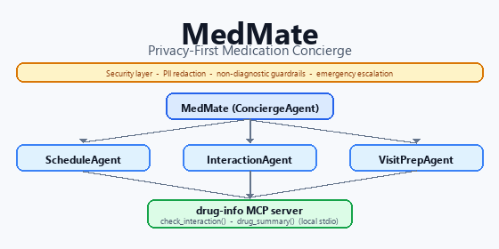

# MedMate — Privacy-First Medication Concierge



A medication **concierge agent** built on [Google's Agent Development Kit (ADK)](https://google.github.io/adk-docs/).
MedMate helps people *organize* their medications — build a reminder schedule,
check drug interactions against a grounded tool source, and turn worries into
good questions for a doctor — **without ever diagnosing or telling anyone to
start or stop a drug**, and while keeping health data on the local machine.

> Built for the Kaggle AI Agents hackathon. Demo project — **not a medical device**.

---

## Problem

People juggling several prescriptions face three everyday, error-prone tasks:
remembering *when* to take what, worrying *whether two drugs clash*, and trying
to *make the most of a short doctor visit*. The obvious move — asking a general
chatbot — is risky: it will happily hallucinate interactions, drift into
diagnosis, and slurp personal health data into a cloud prompt.

## Solution

**MedMate** is a careful concierge, not an oracle. A root agent routes each
request to a focused specialist, drug facts come from **named tools** (not model
memory), personal identifiers are **redacted before they reach the model**, and
the agent is bound by hard safety rules: *never diagnose, never change a
medication, escalate emergencies, keep health data confidential.*

## Why agents (and not a single prompt)

- **Separation of duties.** Scheduling, interaction-checking, and visit-prep are
  different jobs with different risk profiles. Distinct sub-agents keep each
  instruction tight and auditable instead of one sprawling mega-prompt.
- **Grounded tools over recall.** The interaction specialist is *forced* to call
  an MCP tool, which is how we stop the model from inventing drug facts.
- **Routing = intent triage.** A concierge that delegates mirrors how a real
  care team works, and makes the system easy to extend (add a "RefillAgent"
  later without touching the others).

---

## Architecture

```
                          user request
                               |
                               v
                  +-------------------------+
                  |   SECURITY LAYER        |   redact() PII scrub (SSN / email /
                  |   (before-model hook)   |   long IDs) + non-diagnostic &
                  +-------------------------+   emergency-escalation guardrails
                               |
                               v
                  +-------------------------+
                  |  MedMate (ConciergeAgent)|  root LlmAgent — LLM-driven
                  |  intent routing / delegate|  delegation to one specialist
                  +-------------------------+
                     |          |          |
        +------------+          |          +-------------+
        v                       v                        v
 +--------------+      +-----------------+       +----------------+
 | ScheduleAgent|      | InteractionAgent|       | VisitPrepAgent |
 | reminder plan|      | drug clashes    |       | doctor Q's     |
 +--------------+      +-----------------+       +----------------+
                               |
                               | MCP over stdio (local child process)
                               v
                     +----------------------+
                     |  drug-info MCP server |  read-only tools:
                     |  (mcp_server.py)      |   - check_interaction(a, b)
                     |  in-memory demo data  |   - drug_summary(name)
                     +----------------------+
                        (swap for RxNorm / openFDA in production)
```

All three specialists live under the concierge; only the **InteractionAgent**
holds the `drug-info` MCP toolset, but the diagram shows it as the shared
grounded-knowledge source the system reaches for facts. The **security layer**
wraps every model call.

---

## Three course concepts demonstrated

| # | Concept | Where in the code |
|---|---------|-------------------|
| 1 | **ADK multi-agent system** | `agent.py` — root `LlmAgent` **MedMate** with `sub_agents=[ScheduleAgent, InteractionAgent, VisitPrepAgent]` (LLM-driven delegation). |
| 2 | **MCP server for grounded tool use** | `mcp_server.py` — `FastMCP("drug-info")` exposing `check_interaction` + `drug_summary`; `agent.py` connects the InteractionAgent via `McpToolset` over **stdio**. |
| 3 | **Security features** | `redact()` PII scrubber wired as a `before_model_callback`, plus strict non-diagnostic / emergency-escalation / confidentiality rules in the root instruction. |

---

## Setup

```bash
# 1. Install dependencies
pip install -r requirements.txt

# 2. Provide a Gemini API key via environment variable (never commit it)
#    Get one at https://aistudio.google.com/apikey
export GOOGLE_API_KEY="your-key-here"          # macOS / Linux
#   PowerShell:  $env:GOOGLE_API_KEY = "your-key-here"

# 3. (Optional) smoke-test the MCP server on its own
python mcp_server.py        # starts the stdio server; Ctrl+C to stop

# 4. Run MedMate — the MCP server is launched automatically as a child process
adk web                     # browser UI, then pick the "MedMate" agent
#   or, terminal REPL:
adk run .
```

> You do **not** need to start `mcp_server.py` manually for `adk web` / `adk run`
> — `agent.py` spawns it over stdio. Step 3 is just a standalone sanity check.

Environment variables:

| Variable | Required | Purpose |
|----------|----------|---------|
| `GOOGLE_API_KEY` | yes | Gemini model access (read from the environment; never stored in the repo). |
| `MEDMATE_MODEL` | no | Override the model (default `gemini-2.5-flash`). |

---

## Verification

The code is **import-verified** against a real install of the SDKs (not just a
syntax check). Versions confirmed to import and pass tests:

| Package | Version | How verified |
|---------|---------|--------------|
| `google-adk` | **2.3.0** | `import agent` succeeds; `root_agent` builds with its 3 sub-agents. |
| `mcp` | **1.28.0** | `import mcp_server` succeeds; `FastMCP("drug-info")` + both tools register. |

Both are pinned with `==` in `requirements.txt` (Python 3.13). Run the tests:

```bash
pip install -r requirements-dev.txt
pytest -q
```

`tests/test_mcp_server.py` covers the MCP tools (`check_interaction` known
pair / no-interaction / unknown drug; `drug_summary` known / unknown) and the
`redact()` PII scrubber (SSN, email, long IDs masked; doses/years preserved).
Tests make **no network or model calls** — `conftest.py` sets a dummy key so
`import agent` works offline.

## Demo (offline, no API cost)

`python demo.py` prints an illustrative walkthrough — example user inputs and
which sub-agent MedMate would route each to (incl. the emergency-escalation
guardrail). It uses keyword heuristics for the preview; the **real** routing is
LLM-driven by the ADK root agent at runtime. Useful for narrating the demo
video without spending API quota.

---

## Safety

MedMate is **informational only and is not a medical device**. Its guardrails:

- **No diagnosis.** It will not name conditions or interpret symptoms as a diagnosis.
- **No start/stop advice.** It organizes what you already take and flags known
  interactions; decisions stay with your pharmacist and clinician.
- **Emergency escalation.** If you describe a possible emergency (chest pain,
  trouble breathing, stroke signs, severe allergic reaction, overdose, suicidal
  thoughts, etc.), it stops and directs you to local emergency services (e.g.
  **112** in the EU / **911** in the US) instead of triaging.
- **Privacy-first.** PII (SSNs, emails, long ID numbers) is redacted before it
  reaches the model, and the drug-info tools run **locally over stdio**, so your
  drug list and questions are not sent to a third-party tool service.
- **Grounded facts.** Drug interactions come from a tool source, not model
  memory. The bundled dataset is a small demo — swap it for a licensed source
  (RxNorm / openFDA) before any real use.

If you adapt this for real users, treat it as regulated software: validate the
data source, complete proper de-identification, and get clinical review.

---

## Project files

- `agent.py` — ADK app: root **MedMate** concierge, three sub-agents, `redact()`, safety rules, MCP wiring.
- `mcp_server.py` — `drug-info` MCP server with two read-only tools over a demo dataset.
- `demo.py` — offline illustrative routing walkthrough (no API calls).
- `make_cover.py` — renders `cover.png` (560×280 thumbnail) and `architecture.png` (1280×720).
- `tests/test_mcp_server.py` + `conftest.py` — pytest suite (MCP tools + `redact()`).
- `requirements.txt` (pinned) / `requirements-dev.txt` (adds `pytest`) — dependencies.
- `.env.example` — copy to `.env` (gitignored) and set `GOOGLE_API_KEY`.
- `.gitignore`, `LICENSE` — ignore rules (excludes `.env`, `venv/`, keys), MIT license.

> The drug dataset in `mcp_server.py` is a **deliberate demo** (a handful of
> drugs/interactions) so the project runs offline with zero credentials. Swap it
> for a licensed source (NLM **RxNorm**/RxNav + **openFDA**) behind the same two
> tool signatures before any real-world use — the agent code does not change.

---

## License

Released under the [MIT License](LICENSE).
